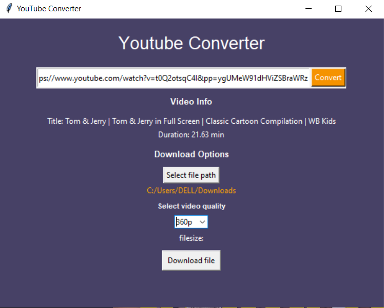

# YouTube Video Downloader GUI

A user-friendly GUI application for downloading YouTube videos. This application allows users to download YouTube videos by providing a link, choose the download path, and select the video resolution.

## Features

- Download YouTube videos by providing a URL.
- Select the download path.
- Choose video resolution from available options.

## Screenshots



*Screenshot of the main interface of the application.*

## Installation

### Installation Steps

1. **Clone the repository**:

    ```bash
    git clone https://github.com/Aswindevpk/Youtube_video_converter.git
    cd Youtube_video_converter
    ```

2. **Install the required packages mentioned in the requirements.txt.**:

    ```bash
    pip install -r requirements.txt 
    ```

## Usage

1. **Run the application**:

    ```bash
    python main.pyw
    ```

2. **Provide the YouTube video link**:

    - Paste the YouTube video URL into the designated input field.

3. **Select the download path**:

    - Use the browse button to choose the folder where the video will be saved.

4. **Pick the resolution**:

    - Choose the desired resolution from the available options.

5. **Download the video**:

    - Click the download button to start the download process.


## Acknowledgments

- Thanks to the [pytube](https://github.com/pytube/pytube) developers for their excellent library.


